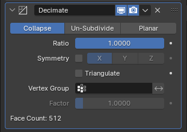
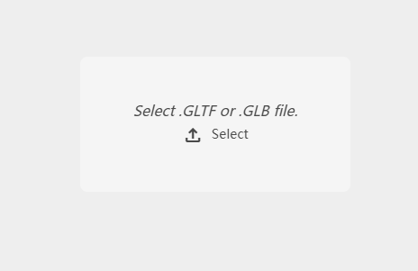
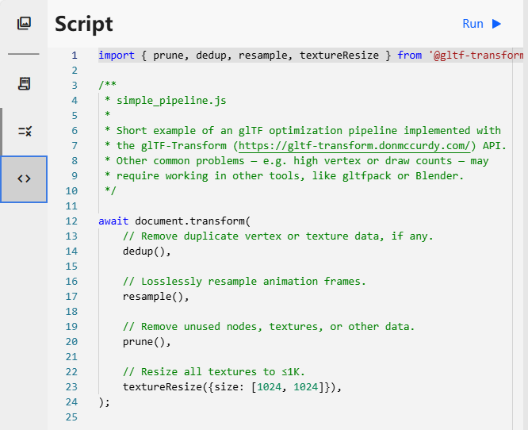
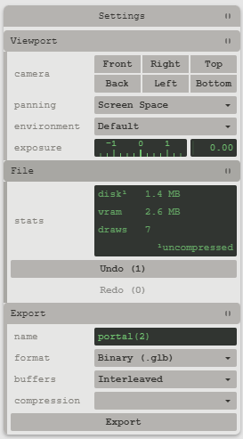

<ArticleTopAd></ArticleTopAd>

## Tutorial

### Environment settings

**Platfrom**:`https://www.8thwall.com/cafilab/ar-shoes/project`
**Account&Password**:`cafilab@polu.edu.hk`  `Gh163itc`

### How to add or delete models

1. Enter the website and login the account above, then open the editor.
2. The only two files you are supposed to exchange your new models in are **body.html** and **models**.
3. ***body.html* sample** 
``` 
<a-assets>
    <!-- models -->
    <a-asset-item id="portal-rim-model" src="./assets/models/portal.glb"></a-asset-item>
    <a-asset-item id="scene-model" src="./assets/models/scene4-v1.glb"></a-asset-item>
    <a-asset-item id="human1" src="./assets/models/human1-v1.glb"></a-asset-item>
    <a-asset-item id="human2" src="./assets/models/human2-v1.glb"></a-asset-item>
    <a-asset-item id="human3" src="./assets/models/human3-v1.glb"></a-asset-item>
    <a-asset-item id="human4" src="./assets/models/human4-v1.glb"></a-asset-item>
    <!-- textures -->
    <video id="portal-video" muted autoplay playsinline crossorigin="anonymous" loop="true" src="./assets/textures/portal-video.mp4"></video>
</a-assets>
```
It means you need to declare your models here first as A-Frame constructure`s assets.
4. ***body.html* sample** 
``` 
  <!-- Portal Contents -->
  <a-entity id="portal-contents">
      
    <a-entity
      gltf-model="#scene-model"
      rotation="0 -90 0"
      position="0 0.5 -32"
      scale="5 5 5"
      shadow="cast: false">
    </a-entity>

    <a-entity
      gltf-model="#human1"
      rotation="0 -90 0"
      position="0 0.5 -32"
      scale="5 5 5"
      shadow="cast: false">
    </a-entity>

    <a-entity
      gltf-model="#human2"
      rotation="0 -90 0"
      position="-3 0.5 -28"
      scale="5 5 5"
      shadow="cast: false">
    </a-entity>

    <a-entity
      gltf-model="#human3"
      rotation="0 -90 0"
      position="0 0.5 -32"
      scale="5 5 5"
      shadow="cast: false">
    </a-entity>

    <a-entity
      gltf-model="#human4"
      rotation="0 -90 0"
      position="0 0.5 -32"
      scale="5 5 5"
      shadow="cast: false">
    </a-entity>

  </a-entity>
```
Then you could locate here to set the models` attributes.
5. Please note that the models declared and initialized in step 3 exist in the **models** folder.

### About model optimization and compression operations

1. As modelling in Blender, for example, you need to add a **Decimate modifier** to the model to reduce the number of facets and vertices.

2. To compress the models you need to use a website tool.`https://gltf.report/`
    In this website, you could directly drop your `.glb` files.

3. And then press the **Script** entering the editor. Here you could also set the size you want to resize all the textures within.I usually set the size either [256,256] or [512,512].

4. Press **Run** to excute the compression operation.
5. Last, press **Export** to get your compreesed models.


### Supplymentary instruction

If you are interested in **A-Frame** learning, here is the official website I provide.`https://aframe.io/`